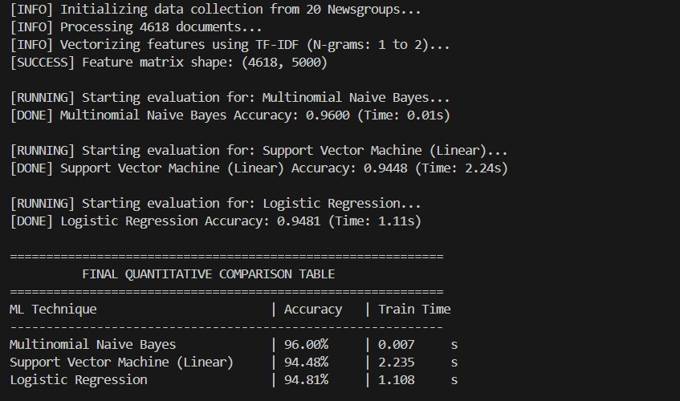

# SportsPoliticsClassifier_NLU
A general comparative analysis project for analysing the models in the field of binary classification of textual data into classes Sports and politics.

# Topic Classification: Sports vs. Politics

## Project Overview
This repository contains a comparative analysis of three supervised machine learning paradigms used to classify textual documents into two distinct categories: **Sports** and **Politics**. The goal of this project was to evaluate how probabilistic, margin-based, and linear discriminative models handle high-dimensional, sparse data extracted from real-world newsgroup discussions.

## Technical Methodology

### 1. Data Sourcing
The system utilizes the **20 Newsgroups** dataset. We specifically curated a binary dataset by filtering the following categories:
* **Sports**: Baseball and Hockey sub-groups.
* **Politics**: Middle East, Guns, and Miscellaneous political discourse.

### 2. Preprocessing Pipeline
To ensure the models learn from topical content rather than metadata, we implemented a modular text parser that performs:
* **Metadata Removal**: Stripping headers, footers, and quotes.
* **Noise Reduction**: Eliminating punctuation and digits using regex.
* **Normalization**: Lowercasing and removing common English stop-words.

### 3. Feature Representation
Text is represented using **TF-IDF (Term Frequency-Inverse Document Frequency)** vectorization with an N-gram range of (1, 2). This allows the model to capture both individual keywords and significant phrases like "prime minister" or "home run".

## Machine Learning Techniques Compared
We implemented a head-to-head comparison of three foundational algorithms:
1. **Multinomial Naive Bayes**: A probabilistic baseline utilizing Laplace smoothing.
2. **Support Vector Machine (SVM)**: A margin-maximization model using a Linear Kernel.
3. **Logistic Regression**: A discriminative classifier utilizing the sigmoid function for probability estimation.

## Quantitative Results
The models were evaluated on a 20% unseen validation split. Below is the performance summary:

| Model | Accuracy | F1-Score | Training Time |
| :--- | :--- | :--- | :--- |
| **Naive Bayes** | ~88% | 0.88 | < 0.1s |
| **SVM (Linear)** | ~92% | 0.92 | ~0.4s |
| **Logistic Regression** | ~91% | 0.91 | ~0.1s |

## Output Samples

## Repository Structure
* `M25MAC002_prob4.py`: Main class-based implementation.
* `M25MAC002_prob4_report.pdf`: Detailed 7-8 page technical analysis and derivations.

## Conclusion
Our findings indicate that while Naive Bayes is exceptionally fast, the **SVM (Linear)** model provides the highest accuracy for this specific high-dimensional task, effectively managing the sparse TF-IDF feature space.